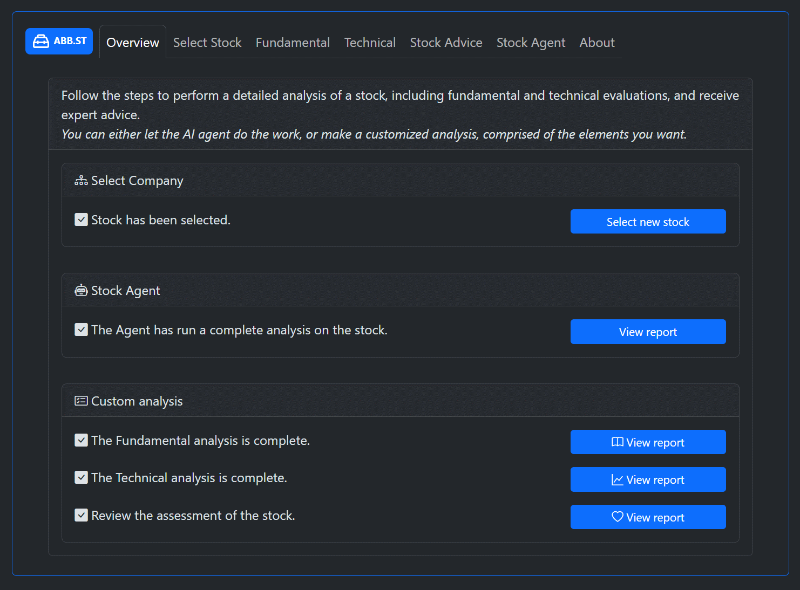
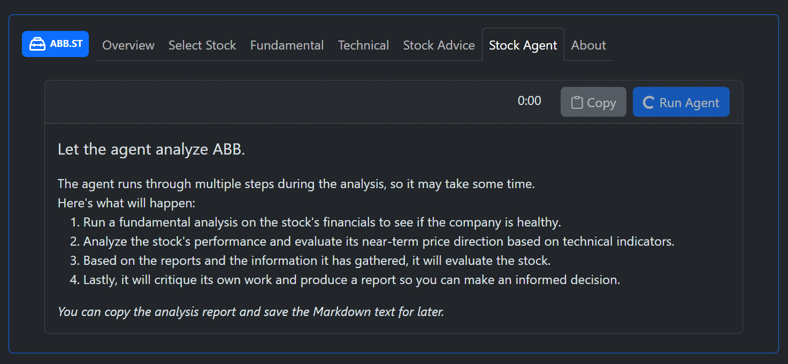

# ai-investment-frontend

# About the App

This project is a Vue.js (v3) frontend for the [ai-investment-manager](https://github.com/waldsterbenn/ai-investment-manager) project (python).

With the app, you can run Techical or Fundamental analysis on a given company's stock, and give you an up to date view on the company's performance in the stock market.



Running an analysis invokes the python backend, via a node.js service.


The python backend leverage a local LLM to evaluate data from different sources, before generating a textual report. When the analysis is complete, the report will be displayed in the app, in markdown format.


> Note that the setup and configuration of the LLM system is done in the [ai-investment-manager](https://github.com/waldsterbenn/ai-investment-manager) project.

# Setup

## Install required software

If you have not made a Vue app before, we need to install some software.

## Node server components

[Node.js 23](https://nodejs.org/en/download/package-manager)

## Yarn package manager

[Yarn 4.5.1](https://yarnpkg.com/getting-started/install)

## VSCode extention

Install **"Vue - Official"** VSCode extention.
From the Extentions menu (`Ctrl+Shift+X`)

This plugin integrates VSCode with vue app running in browser for seamless debugging. But also enable VSCode to handle Vue + Typecript.

## Check out the Vue docs

https://vuejs.org/guide/quick-start.html

---

# Start webapp first time

## Node

We use modern Node env. This means that Node.js is not installed globally on the machine, but is handled through the FNM (Fast Node Manager).
Use the start_node.ps1 scripts for easy setup.
This is required every time the system has been restarted.

## Vue

This repo is already configured with a Vue.js app, so you should be able to just run vue app on localhost:

```
    cd ai-investment-frontend
    yarn
    yarn dev
```

Running the single `yarn` command will make the package manager spin through the package.json and install the required _"dependencies"_. So you should only run this the first time or when you change the package.json dependencies.

Just run `yarn dev` to start the webapp. Or, use the start_node.ps1 scripts for easy setup.

# Other scripts

Run any of the other _"scripts"_ defined in: ai-investment-frontend\package.json

For example: `yarn lint`, to run the linter and check source files for errors and syntax problems.

# A note on python

To use the system Python 3 must be installed along with anaconda3.
Python scripts will be run in conda environments to allow them to use required libraries.
